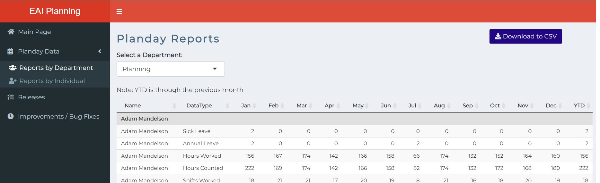

[![Issues][issues-shield]][issues-url]
[![LinkedIn][linkedin-shield]][linkedin-url]

<h3 align="center">Roster Data</h3>

  

    An internal Shiny App that displays and backs up scheduling data.
     
  

<!-- TABLE OF CONTENTS -->

  
Table of Contents

  <ol>
    <li>
      <a href="#about-the-project">About the Project</a>
      <ul>
        <li><a href="built-with">Built With</a></li>
      </ul>
    </li>
    <li><a href="#roadmap">Roadmap</a></li>
  </ol>

<!-- ABOUT THE PROJECT -->
## About the Project

A simple Shiny App to backup, display and report schedule data accessed from API calls.

(<a href="#top">back to top</a>)

<!-- BUILT WITH -->

## Built With

* [Python](https://www.python.org/)
* [Shiny](https://shiny.rstudio.com/)
* [PostgreSQL](https://www.postgresql.org/)

(<a href="#top">back to top</a>)

### Prerequisites

This is an example of how to list things you need to use the software and how to install them.
Add info about getting API refresh token.

<!-- ROADMAP -->
## Roadmap

- [ ] More functional dashboard.
- [ ] Better reporting.
- [ ] Automate weekly checks.

See the [open issues](https://github.com/adam-mandelson/eai-scheduling/issues) for a full list of proposed features (and known issues).

(<a href="#top">back to top</a>)

<!-- MARKDOWN LINKS & IMAGES -->
<!-- https://www.markdownguide.org/basic-syntax/#reference-style-links -->
[issues-shield]: https://img.shields.io/github/issues/adam-mandelson/eai-scheduling.svg?style=for-the-badge
[issues-url]: https://github.com/adam-mandelson/eai-scheduling/issues
[linkedin-shield]: https://img.shields.io/badge/-LinkedIn-black.svg?style=for-the-badge&logo=linkedin&colorB=555
[linkedin-url]: https://linkedin.com/in/adam-mandelson
